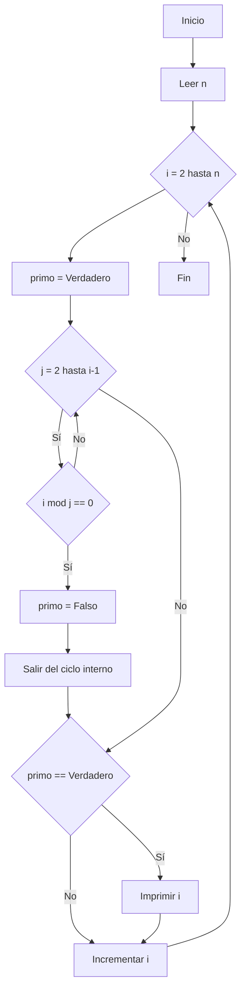

# RETO #3
Para este reto tenemos como objetivo plantear el algoritmo para obtener los números primos hasta n, usando pseudocódigo y diagramas de flujo.

Primero comenzaremos con pseudocodigo y luego continuaremos con el diagrama de flujo:

## PSEUDOCODIGO

Inicio
    Escribir "Ingrese un número entero n:"
    Leer n

    Para i desde 2 hasta n hacer
        primo ← Verdadero
        Para j desde 2 hasta i - 1 hacer
            Si i mod j = 0 Entonces
                primo ← Falso
                Salir del ciclo
            FinSi
        FinPara

        Si primo = Verdadero Entonces
            Escribir i
        FinSi
    FinPara
    Fin

## DIAGRAMA DE FLUJO

